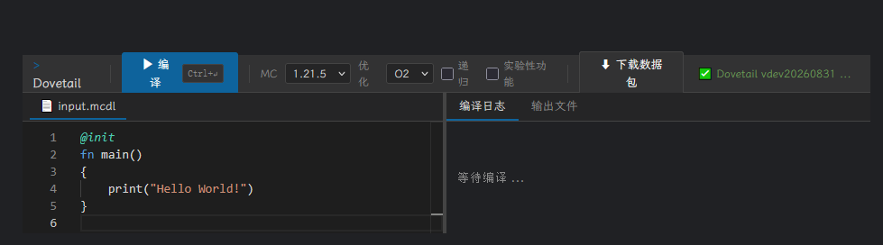

# Dovetail

[English Version](README_EN.md) | [中文版本](README.md)

> Minecraft数据包编译语言 - 具有部分面向对象特性的解决方案  
> **Dovetail** 是一种具有面向对象特征的语言，可以编译成`Minecraft 数据包`(以下简称`数据包`)。它旨在将传统命令的过程导向改变为目标导向。
> 由于技术及作者精力限制，短期内将不会有新的功能实现提交。
>
> **目前状态：**
> - **优点:** 语法基本可用，能够编译简单程序。
> - **已知局限:** 缺乏大量标准库、错误信息不友好、优化器可能引入错误、尚未实现完整的OOP特性和数组借用机制。
> - **生产环境建议:** 如果您需要用于生产环境，请考虑使用其他成熟的项目。
> - **性质:** 相较于 **clang-mc**等追求稳定性的项目，本项目会更偏向使用较为激进的特性和优化，以及对一些内容的实验性处理，这些修改可能不会特殊标注且缺少长期的稳定维护。
> - **语法:** 语法更新迭代较快，因此不保证向后兼容，仅发布正式发行版时保证附带示例语法正确，面对对象具体语法待定，可能存在较大变化
> - **Minecraft 版本支持:** 相较于其他语言，本项目不会有较为稳定的版本支持，即不会长期停留在特定版本

## 目标

- [ ] 一次编写，处处 ~~报错~~编译
- [ ] 基本面对对象支持
- [ ] 完善的依赖库，使开发者不直接操纵指令
- [ ] 低开销数据包
- [ ] 迭代版本跟上我的世界版本大版本更新

<!-- 生成的指令难以阅读不知道算不算优点（ -->

## 长期计划

- [x] 通过使用前置数据包以提高安全性
- [x] 优化错误显示
- [x] 统一日志输出
- [ ] 完善插件功能
- [ ] 编译器国际化支持
- [ ] 允许通过简单的语法声明和调用其他数据包
- [ ] 谓词，自定义数据等功能

<!-- - [ ] 函数一等公民化（一辈子都做不出来）-->

- [ ] 简易事件系统及注解功能
- [ ] 完善内置库

<!-- 也许会做一个类似 dovetail-api 的东西，和编译器分开，分成多个仓库，类似 fabric 和 fabric api -->
<!-- dovetail-api 再由 git 和 dovetail-build 拉取 -->


## 特点

- 支持递归 (开销较大，因此对于尾调用形式，会采取尾调用优化的形式优化)


## 快速开始

### 在线体验
 
此项目提供了 [在线编译器](https://771835.github.io/dovetail/) 以供快速体验 Dovetail 语法：
 

 
> ⚠ 在线编译器仅支持单文件编译，不支持项目模式，且版本可能落后于主线。

### 本地使用

#### 环境要求

- Python 3.11+
- Minecraft Java Edition 1.21.5

#### 安装

```bash
git clone https://github.com/771835/dovetail.git
cd dovetail
pip install -r requirements.txt
python main.py -O2 xxx.mcdl
```

详细内容见[快速开始](docs/zh-cn/quick-start.md)

## 代码示例

```mcdl
// 定义函数
fn greet(name: string) {
    print(f"Hello, {name}");
}

// 入口函数（使用@init注解）
@init
fn main() {
    greet("World")
    greet("Bob")
}
```

## 贡献

### 如何参与贡献

- 提交问题建议：
    - 提交一个 issue，项目作者或其他贡献者会进行修改。
- 修复或提交问题：
    - 提交一个 issue 或创建拉取请求，等待修复或功能实现。
- 实现复杂功能：
    - 根据相应功能创建或更新 DFP 文档提案。
    - 待社区讨论达成共识后，克隆新分支进行代码修改。
    - 进行测试，确保功能正确。
    - 合并代码至主分支。
- 如何验证数据包是否正确运行以及项目接受哪些运行报告
    - Minecraft 实机运行
    - 使用[Datapack Sandbox](https://github.com/Alumopper/DatapackSandbox)模拟运行

### 关于AI工具使用

本项目允许在编写过程中使用AI等辅助工具，但请务必对生成的代码进行审查。

#### 在代码贡献中

`AI`等工具所占代码比例 **不得超过`40%`**，代码内字符串文档不算在此内。  
一些重复性工作，如编号等也可交由`AI`等工具处理

#### 在文档、文档翻译、教程中

`AI`等工具生成内容应进行完整详细的审查，最终以代码实际实现为准绳。

<!-- 事实上作者都不遵守这一规定，理论上只要你对你代码审查完整，理解是怎么运作的，不存在严重的AI幻觉，别人也分辨不出 -->

## FAQ

Q: 为什么不推荐使用递归?  
A: 递归需要运行时维护栈帧，在Minecraft中性能消耗较大,因此建议将递归算法改写成迭代实现。    
Q: `UB`行为保证在不同优化管道实现相同效果吗？  
A: 不做保证，尤其是类似`_fast`结尾的函数和一些内置函数，优化管道会猜测其行为并代替调用。  
Q: 为什么编译器提示未知错误并提供堆栈信息？该如何解决？  
A: 请在 GitHub 提交一个 issue，报告该问题。  
Q: 为什么生成的数据包在执行时中止?  
A: 请尝试使用`gamerule`指令适当提高`maxCommandChainLength`规则的数量  
Q: 找不到可用后端怎么办?  
A: 安装对应后端插件  
Q: 如何调试错误/我的代码报错了，怎么解决?  
A: 可以参考[调试指南](docs/zh-cn/debugging-guide.md)  
Q: 项目有没有 lsp 插件?  
A: 有的有的，过于垃圾，不便于展示 (
<!-- 其实是 AI 的一坨大的，外表风光靓丽，内里纯纯一坨 -->

## 许可证

本项目采用 Apache 2.0 授权

这意味着您 **可以**自由地将其用于个人或商业目的，无需经过本项目作者或贡献者直接许可。

但是，如果您在项目/产品中使用了本作品并从中获得了商业价值，本项目非常欢迎您通过以下方式予以认可 (以下内容不是强制的)：

- **注明来源**：在您的产品文档或在关于页面中提及本项目。
- **分享改进**：将您基于本项目所做的改进回馈给社区。
- **进行贡献**：欢迎提交代码、报告问题、改进文档或提出建议，共同让项目变得更好。

感谢您的支持！
<!-- 社区在哪？鬼知道qwq -->

## 鸣谢

### 参与测试

- 4424 在项目前期发现了诸多bug并提出了大量具有建设性的意见
- [xia-mc](https://github.com/xia-mc) 提供了递归的实现思路 

### 代码使用

> 由于 `Minecraft` 版本以及实际使用等原因，使用时可能会对以下项目进行一定的必要修改。如果您是以下项目作者或贡献者，且不希望您的项目被使用或修改，请联系本项目作者讨论移除事宜。

- 项目[fast_integer_sqrt](https://github.com/Triton365/fast_integer_sqrt) 快速整数开方  
  _[mathlib](lib/mathlib.mcdl)中的isqrt函数_

- 项目[DNT-Dahesor-NBT-Transformer](https://github.com/Dahesor/DNT-Dahesor-NBT-Transformer) 安全字符串拼接，NBT转JSON等SNBT与字符串操作

### 数据使用

- [Minecraft 中文Wiki 数据包版本](https://zh.minecraft.wiki/w/Template:Data_pack_format) 动态更新`Minecraft`与`数据包版本`
  之间的对应关系

### 其他推荐

- [《Feature》](https://vanillalibrary.mcfpp.top/datapack-index/feature/_index.html)
  是由香草图书馆团队主办的，面向原版模组（数据包+资源包）开发的短文收集与展示的平台，用于开发者之间的交流，每月更新。
- [Datapack-Sandbox](https://github.com/Alumopper/DatapackSandbox) 一个轻量、洁净室实现的 Minecraft Java 数据包沙盒。

### 思路来源/大佬鸣谢

- 大佬[zmr-233](https://github.com/zmr-233/) 提出了解决递归问题的思路 (虽然ta推荐的书我都没看，也没按照其思想实现)

### 相似项目

- 项目[MCFPP](https://github.com/MinecraftFunctionPlusPlus/MCFPP) 一门类似 Java 的面对对象语言，完整模拟了堆栈，因而支持递归
  (其作者更新重心不再此，因此更新较慢)。
- 项目[clang-mc](https://github.com/xia-mc/clang-mc) 一个编译工具链项目，实现汇编的在mc中的部分支持和 `C` 代码编译到
  `mcfunction` 语言 (其作者目前不活跃)。
- 项目[Minecraft-Script](https://github.com/SpyC0der77/Minecraft-Script) 简化 Minecraft 数据包创建的编程语言，支持生成较多的版本数据包
  (比较简陋，并不是完整的编译器，不过实现思路挺好玩的)(目前不活跃)。
- 项目[Kore](https://github.com/Ayfri/Kore) 一个用于生成 Minecraft 数据包的 Kotlin 库
  (更新较为活跃，但是不是一门独立的编程语言)。
